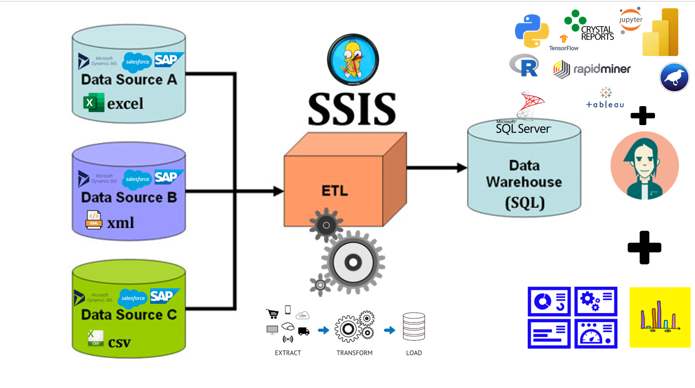
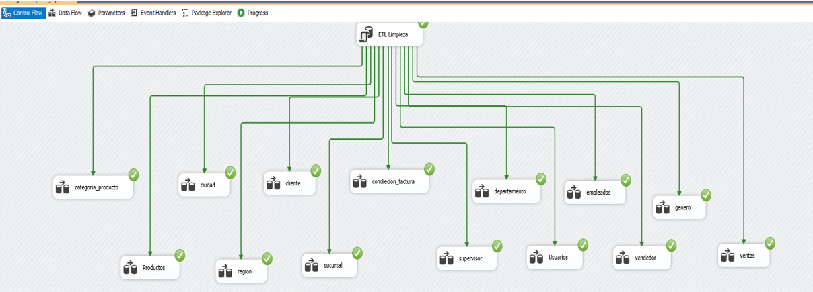
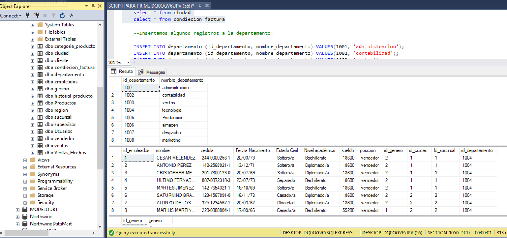

# CARGA_DE_DATOS_INTEGRATION_SERVICES_SQL_EXCEL
CARGA DE DATOS DESDE EXCEL A SQL POR INTEGRATION SERVICES ETL DESDE EXCEL A SQL SERVER

La herramienta de SQL Server Integration Services (SSIS) es parte de la Inteligencia de Negocios que permite realizar procesos de Extracción, Transforamación y Carga (ETL)  de los datos para luego proceder a explotar la información empresarial para apoyar en la toma de decisiones.

###

## 📚 MANUAL DOCUMENTADO:
https://docs.google.com/presentation/...

## 📝 ARCHIVO DE EXCEL:
https://docs.google.com/spreadsheets/...

### 🎞 VIDEO ANTERIOR CON IMPORT  AND EXPORT DATOS DESDE EXCEL Y VICEVERSA:
[https://www.youtube.com/watch?v=L_ATm...](https://www.youtube.com/watch?v=OHN8ME79Z1A&t=1501s)

##✔ Sigueme en mis Redes Sociales:

##👨‍💼 LinkedIn: https://www.linkedin.com/in/juancitop...

##📰 Blog: https://advisertecnology.com/

##📷 Instagram: https://www.instagram.com/juancito.pe...

##📑 Facebook: https://www.facebook.com/juancito.p.v​

##🐦 Twitter: https://twitter.com/JuancitoPenaV​

💚😍❤ No Olvides Suscribirte y Compartir:
